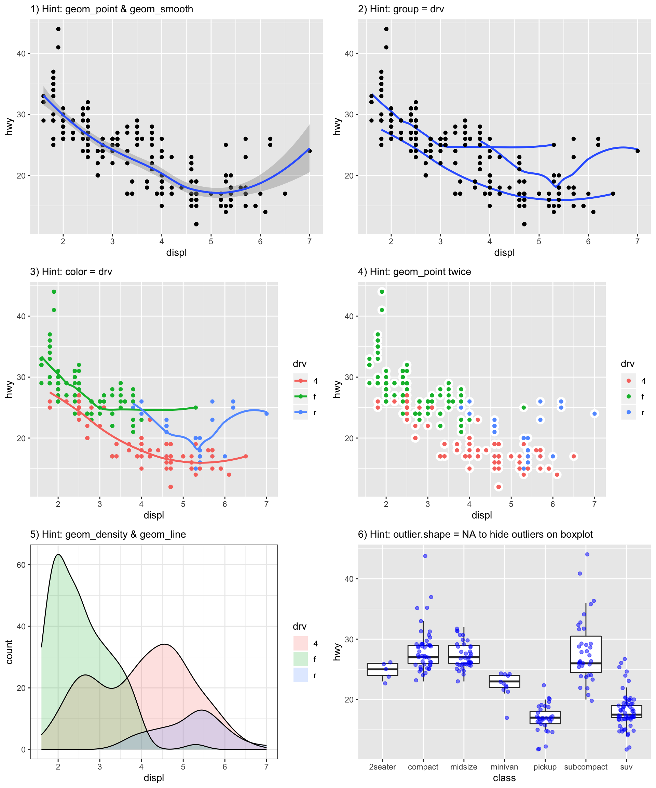
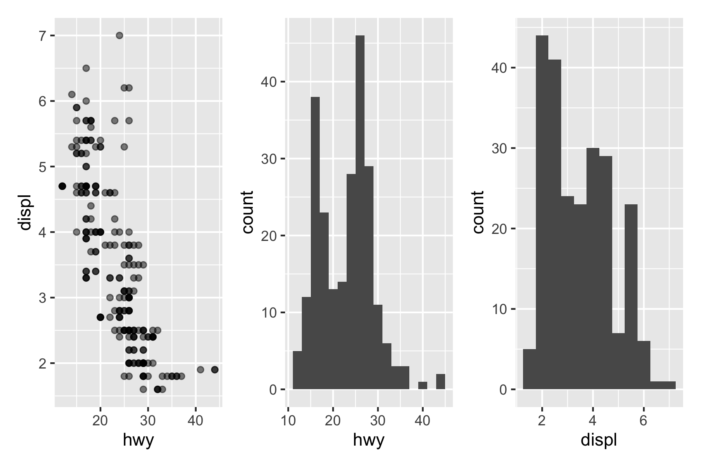
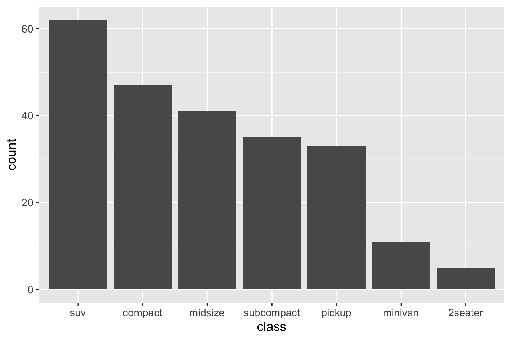

```{r setup, include=FALSE}
# Load the tidyverse packages
library(tidyverse)
```

## Instruction

* Complete this RMarkdown file and "Knit" the HTML output (saved as **Lecture5_YOUR_CID_NUMBER.html**) and upload to the Hub before the deadline.
* Change the author property in the YAML header above to your CID number. 
* For this exercise, we will use `mpg` dataset that comes with `ggplot2` package. This is a dataset of fuel economy data from 1999 and 2008 for 38 popular models of car. 
* To complete this exercise, make sure you have installed the tidyverse package. `install.packages("tidyverse")`
* Reproduce the plots shown in the image below.  



### Plot 1

```{r }
# Plot 1

```

### Plot 2

```{r }
# Plot 2

```

### Plot 3

```{r }
# Plot 3

```


### Plot 4

```{r }
# Plot 4

```


### Plot 5

```{r }
# Plot 5

```

### Plot 6

```{r }
# Plot 6 

```

### Plot 7

Create the following plot using the `patchwork` package. Read the documentation online. [https://patchwork.data-imaginist.com](https://patchwork.data-imaginist.com)



```{r}
# Plot 7 
# install patchwork then load the library
if(!require(patchwork)) {install.packages("patchwork"); library(patchwork)}

```

#### Optional
The code blow is an advanced use case of patchwork. We will cover `scale` functions in the next lecture, but see if you can understand how the plot is constructed. For further details on the layout, read [**Controlling Layouts**](https://patchwork.data-imaginist.com/articles/guides/layout.html) page.

```{r}
p1 <- ggplot(mpg) +
  geom_point(aes(x = hwy, y = displ), alpha = 0.5) +
  scale_x_continuous(limits = c(10, 45)) +
  scale_y_continuous(limits = c(1, 8))

p2 <- ggplot(mpg) +
  geom_histogram(aes(x = hwy), binwidth = 2, color = "black", fill = "lightgray", na.rm = T) +
  scale_x_continuous(limits = c(10, 45))

p3 <-  ggplot(mpg) +
  geom_histogram(aes(x = displ), binwidth = 0.5, color = "black", fill = "lightgray", na.rm = T) +
  scale_x_continuous(limits = c(1, 8)) +
  coord_flip()

p2 + plot_spacer() + p1 +p3 + plot_layout(ncol = 2, nrow= 2, widths = c(4, 1), heights = c(1, 4))

```


### Plot 8

Create the following plot using the `forcat` package to sort the order. Change the x-axis label by calling `+ labs(x = "class")`.




```{r}
# Plot 8


```


