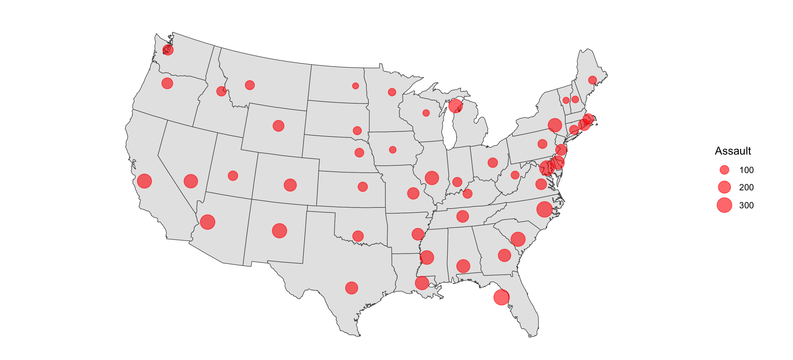

```{r setup, include=FALSE}
# Load the tidyverse packages
library(tidyverse)
```

## Instruction

* Complete this RMarkdown file and "Knit" the HTML output (saved as **Lecture9_YOUR_CID_NUMBER.html**) and upload to the Hub before the deadline.
* Change the author property in the YAML header above to your CID number. 

* To complete this exercise, make sure you have installed the tidyverse package. `install.packages("tidyverse")`
* There will be a few valid apporaches to answer these questions. 


## Colour Scale

* Apply an appropriate `scale_*_viridis_d()` function to the histogram generated below. 
* Try applying a non-default viridis pallet.
```{r}
# create a new variable by binning by price
df <- diamonds %>%
  mutate(price_bin = ntile(price, 10),
         price_bin_label = factor(price_bin, levels = c(1:10), 
                                  labels = c("0-10%", "10-20%", "20-30%", "30-40%", "40-50%", 
                                             "50-60%", "60-70%", "70-80%", "80-90%", "90-100%")))
ggplot(data = df) +
  geom_histogram(mapping = aes(x = carat, fill = price_bin_label), binwidth = 0.1) 

```


### Choropleth

* In the lecture, we created a choropleth of the US using the `USArrests` dataset. This time use the `UrbanPop` attribute in the dataset.
* Pick another colour scheme. You can see palette from `RColorBrewer` package by running `dsiplay.brewer.all()`.
* Select a sequential colour palette. 

```{r}
#  The code below will install the package if not installed
if(!require(RColorBrewer)) {install.packages("RColorBrewer"); library(RColorBrewer)}

# using USArrests datasets
crimes <- data.frame(USArrests) %>% 
  mutate(state = tolower(rownames(USArrests)))

# get a map by states
states_map <- map_data("state")

# merge datasets together
crime_map <- states_map %>% 
  left_join(crimes, by = c("region" = "state")) %>% 
  arrange(group, order)

# Your code here
```


### Layering on a Map

* Instead of using the colour to encode the quantitative value, use the circle area to encode the `Assult` values.
* Complete the code below to reproduce the image below.
* Hint: use `scale_size_area()`

```{r}
summary <- crime_map %>% 
  group_by(region) %>% 
  summarise(mean_long = mean(long),
            mean_lat = mean(lat),
            Assault = first(Assault)) %>% 
  filter(!is.na(Assault))

# US map
us_map <- ggplot()+
  geom_polygon(data = crime_map, aes(x=long, y=lat, group = group), fill = "gray90", colour = "gray30", size = 0.25)+
  coord_map("albers", lat0=30, lat1=40)+
  theme_void() 

# draw data points on top. Write your code to layer on top of the map.
us_map 
```




## COVID 19 Data data analysis

In the exercise below, you will load data from the European Cenre for Disease Control (ECDC) and create visualisation outputs with annotations. Further information about the data [here](https://www.ecdc.europa.eu/en/publications-data/download-todays-data-geographic-distribution-covid-19-cases-worldwide).

We will use the **lubridate** package to parse the date attributes. The code below will show an example to get you started on exercises. 

```{r}
#  The code below will install the package if not installed
if(!require(lubridate)) {install.packages("lubridate"); library(lubridate)}
```


```{r}
# Loading the latest data from ECDC
raw <- read.csv("https://opendata.ecdc.europa.eu/covid19/casedistribution/csv", na.strings = "", fileEncoding = "UTF-8-BOM", stringsAsFactors = F)

# Parse the date column
all_data <- raw %>%
  mutate(date_reaported = mdy(paste0(month, "-", day, "-", year)))

# UK analysis
uk_data <-  all_data %>% filter(countriesAndTerritories == "United_Kingdom")

uk_data %>%
  ggplot(aes(x = date_reaported, y = cases)) +
  geom_line(stat ="identity", color ="royalblue") +
  theme_minimal() +
  labs(title ="Daily COVIDd-19 Cases reported in UK", x ="", y ="Number of cases reported")

```

### Annotations

Starting from the code above, annotate when the UK government announced lock-down measures. 

```{r}
#  your code here
```


### Create a chart to tell as story

Create a chart with this dataset to tell a story. You may look for an inspiration in the news or social media, and try recreate a similar chart. You may consider the followings as examples:

* Compare between countries. You may find additional data, such as the dates of lockdown announcements.
* Try different scales, ex. log or square root scales...
* You may aggregate the data to highlight other aspects of data.
* You may consider filtering to look at the data from a specific timeframe by filtering the data, ex. the last 3 months.
* You may choose a country of your choice to analyze further.
* It is up to you to choose which geometric objects to use. Yo may want to consider layering. 

```{r}
# your code

```

Write some comments or insights you gain from the chart you created.
* insight 1
* insight 2

