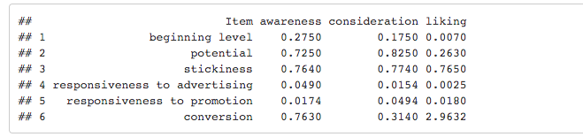

</br>
</br>


---

## Application

Now it is your time to apply what we have learned in this session! 

Imagine you are the brand manager of this shampoo brand. Would you agree to double the promotion effort while remain advertising the same instead? How is that compared with the strategy that fivefolds advertising instead? Please show your calculations and discuss the pros and cons.

---


```{r, include=FALSE}
knitr::opts_chunk$set(echo = TRUE, warning=FALSE, message=FALSE)
library(knitr)
library(kableExtra)
library(readxl)

#install.packages("forecast")
#install.packages("tseries")
library(forecast)
library(tseries)
library(vars)
```


</br>


```{r}
## read the data in
data_shampoo <- read_excel("~/Dropbox/mindset_shampoo.xlsx")
```

</br>
</br>
</br>
**Doubling Promotion Expense**

</br>

First, let us recall what we've got as parameters from the main analysis covered in this session:
</br>





</br>

Now imagine that we decided to double our advertising expenditure from 100K USD to 200K USD per month and keep advertising the same. How do we make the calucation then? Let us visualize the logics by using the table below: 


```{r echo=FALSE}

table_whatif<-data.frame(
  Item = c("Advertising", "Promotion" ,"Awareness", "Consideration", "Liking", "Sales"), Start=c(100,100, round(mean(data_shampoo$awareness)/100,3), round(mean(data_shampoo$consideration)/100,3), round(mean(data_shampoo$liking/7),3),round(mean(data_shampoo$vol),3)), New=c( 100, 200, "?" ,"?" ,"?" ,"?" ), Gain = c(0, 100, "?" ,"?" ,"?" ,"?"  ), LRGain = c( "/", "/", "?" ,"?" ,"?" ,"?" ), Conversion =c("/", "/", "?", "?", "?", "/"))

table_whatif
```

The cells with "?" are the ones that need us to calculate and fill in.

To briefly summarize, we need to:
(1) Firstly, derive the new level of each mindset metric and sales based on the changes that we decide to make to the marketing mix (i.e., advertising and promotion). 
(2) Then by comparing the new and the old level we can derive immediate or short run gain for each metric and sales. 
(3) Next, with the help of carry-over parameters from responsiveness models, we trasform those short-run gain to corresponding long-run gain. 
(4) And lastly, to decompose long-run gain in sales and attribute it to gains due to mindset metrics and gains due to transaction, we calculate how much do those long-run gain from step (3) translate to actual increase in sales. 


*New*

From the table, the column "Start" summarizes all the base values for each item. For example, the average level of awareness, expressed in percentage terms, is 21.51%, leaving a 78.49% potential. 

Now we need to decide what happens to all the mindset metrics and sales after we fivefold advertising (from 100 to 500). First, we need to determine what is the new level of each metric and sales after the change to marketing mix. More specifically, change in marketing mix exerts its impact on each metric through short-run responsiveness. Therefore, we need to go back to our previous analysis and use the model parameters in responsiveness models. For mindset metric $M_i$ (i=1,2,3 in our case), we apply the formula below:

\[

New_{M_i} = Start_{M_i} *(Promotion_{new}/Promotion_{old})^{Responsiveness_{Promo_{M_i}}})

\]


</br>
```{r}
#Note that we do not include short run impact of change in ads on each mindset metric and sales becuase there is no change (100/100=1)

new_awareness <- round(0.275 * (200/100)^(0.0174) ,3)
new_consideration <- round(0.175 * (200/100) ^ (0.0494),3)
new_liking <- round(0.737 * (200/100) ^ (0.0180),3)
#the responsiveness of sales to promotion can be found in the "table_response_sales" 
new_sales <- round(1800.391 * (200/100) ^ (0.2722),3)
	
  
```

</br>
*_Gain (Short Run)_*
</br>
```{r}
#Calculate gain (from "start" to "new")
gain_awareness <- round((new_awareness/0.275)	-1,3)
gain_consideration <- round((new_consideration/0.175)-1,3)
gain_liking <-round( (new_liking/0.737)-1,3)
gain_sales <-round((new_sales/1800.391)-1,3)


```


</br>
*_Gain (Long Run)_*
</br>

Now we can "translate" the short run gain to long run gain for each metric and sales. 
To do this, we need to make use of the stickiness (gamma) we get from responsiveness models (you may want to go back and check the table named "table_responsiveness"). Again, for each mindset metric $M_i$ (and also for sales):

\[LRGain_{M_i} = Gain_{M_i}/(1-Carryover_{M_i}) \]

```{r}
#Calculate long run gain for each mindset metric and sales
	
lrgain_awareness <- round(gain_awareness/(1-0.0921),3)
lrgain_consideration <-round(gain_consideration/(1-0.2081),3)
lrgain_liking <- round(gain_liking/(1-0.0164),3)
lrgain_sales <- round(gain_sales/(1-0.1115),3)
```

</br>

*_Conversion_*
</br>

To finish the final step, we need to go back and refer to conversion model (you may want to go back and check the table named "table_conversion"):

\[Conversion_{M_i} = LRGain_{M_i} * Conversion_{M_i}\]


```{r}
#Calculate conversion, i.e., decompose the gain and attribute to awareness, consideration, and liking

conversion_awareness <- round(lrgain_awareness *  0.7630,3)
conversion_consideration <-round(lrgain_consideration * 0.3140,3)
conversion_liking <- round(lrgain_liking * 2.9632,3)
  
  		
```
</br>
*_Final Output_*
</br>

Finally, we are able to fill in all the blanks:


```{r echo=FALSE}
table_whatif<-data.frame(
  Item = c("Advertising", "Promotion" ,"Awareness", "Consideration", "Liking", "Sales"), Start=round(c(100,100, mean(data_shampoo$awareness)/100, mean(data_shampoo$consideration)/100, mean(data_shampoo$liking/7),mean(data_shampoo$vol)),3), New=round(c( 100, 200, new_awareness ,new_consideration, new_liking ,new_sales ),3), Gain = round(c(0, 100, gain_awareness, gain_consideration, gain_liking, gain_sales  ),3), LRGain = c( "/", "/", lrgain_awareness, round(lrgain_consideration,3), round(lrgain_liking,3), round(lrgain_sales,3) ) , conversion =c("/", "/", round(conversion_awareness,3),round(conversion_consideration,3), round(conversion_liking,3),"/"))

table_whatif

```

</br>

Summing $Conversion_{awareness}$, $Conversion_{consideration}$, and $Conversion_{liking}$, we can get the total long run gain in sales that originates from improvement in mindset metrics. 
* We have: 0.246+0.014+0.036 = 0.296

Given that there is a 23.4% gain in sales, we can tell that:

* Long term sales gain = 23.4%
* Sales gain due to mindset metrics = 29.6%
* Sales gain due to transactions = 23.4%-29.6% = -6.2%

</br>
</br>
Therefore, briefly speaking, compared with fivefolding advertising expense, which leads to a 10.9% increase in brand sales, doubling promotion seems to be more effective in driving up sales. Moreover, consumer mindset metrics are significantly more driven up by changes to promotion (29.6% increase). However, there are certain loss in sales due to transaction (-6.2%). Therefore, depending on the objective of the brand, an "optimal" strategic change can be derived.


